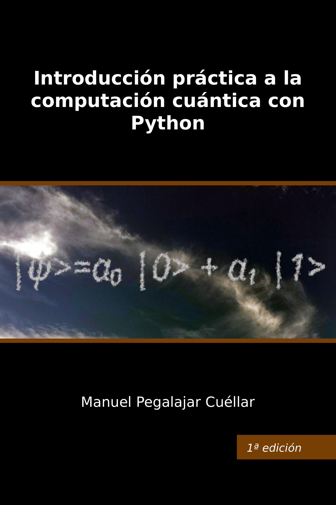

# Introducción práctica a la computación cuántica con Python

Este repositorio contiene el código fuente asociado al libro **Introducción práctica a la computación cuántica con Python**. Para obtenerlo, descargue el fichero *IntroQC.zip* y descomprímalo en la carpeta que desee. El código fuente podrá ejecutarse si dispone de un intérprete de Python instalado, junto con las bibliotecas requeridas en el libro, según se indica en el apartado *Manos a la obra: instalación de software y acceso al código fuente*.

  

